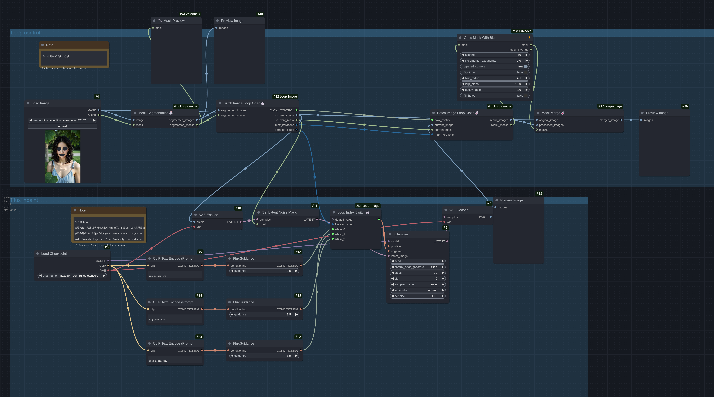
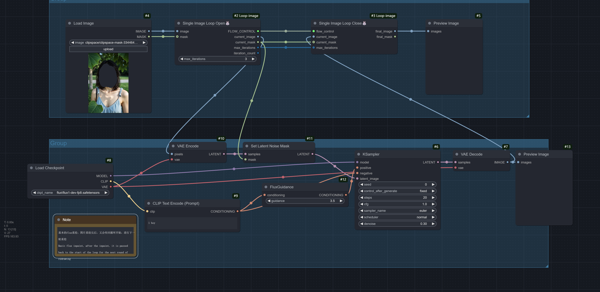

# ComfyUI Loop Image

This repository is a modified version of [original project URL](https://github.com/WainWong/ComfyUI-Loop-image).
Modifications were made by wonbinK in 2025.

## Modification

- We add LoopReduceOpen, LoopReduceClose nodes

### LoopReduce Processing
- Suitable for processing with dynamic input size
- It is similar to Reduce function
- Example
 - make a list with dynamic input size

---

[English](README.md) | [简体中文](README_CN.md)

---
## Latest Update (2025-01-25)
Enhanced the batch processing capabilities with a new feedback loop feature:
- Added `pass_back` option in BatchImageLoopClose to enable passing processed images back to the loop start
- BatchImageLoopOpen now automatically expands single images to match mask batch size

## Update (2025-01-19)
Added a new route selection workflow example demonstrating advanced Loop Index Switch usage. Located in "examples/Route_Selection", this workflow showcases path selection based on iteration count using lazy loading features:
- First iteration (0): Executes Flux Redux workflow
- Second iteration (1): Executes Flux Pulid workflow

See example files for detailed implementation.

---

## Introduction
ComfyUI Loop Image is a node package specifically designed for image loop processing. It provides two main processing modes: Batch Image Processing and Single Image Processing, along with supporting image segmentation and merging functions.

## Differences between Batch and Single Processing

### Batch Image Processing
- Suitable for scenarios requiring simultaneous processing of multiple different regions
- Uses Mask Segmentation node to divide images into multiple parts
- Processes one segmented region per iteration
- Merges results through Mask Merge after all regions are processed

### Single Image Processing
- Suitable for scenarios requiring multiple processing passes on the same image
- Uses the result of the previous iteration as input for the next
- Enables progressive image modification
- Ideal for iterative optimization tasks

## Node Documentation

### 1. Batch Processing Nodes

#### Mask Segmentation🐰
- **Functionality**
  - Automatically segments a mask containing multiple independent regions into separate mask sequences
  - Each segmented mask corresponds to an independent region in the original image
  - Segmentation based on connected component analysis

- **Segmentation Rules**
  - Independent regions are identified as separate parts
  - Regions with holes are properly processed, maintaining hole structure

- **Sequence Rules**
  - Masks are arranged from left to right, then top to bottom
  - Sorting based on leftmost pixel position, then topmost pixel position
  - This order determines subsequent processing sequence
  - Example: In a mask with three regions, leftmost region is iteration 0, middle is 1, rightmost is 2

#### Batch Image Loop Open🐰
- **Input/Output Details**
  - Inputs:
    - segmented_images: Image sequence from Mask Segmentation
    - segmented_masks: Mask sequence from Mask Segmentation
  - Outputs:
    - current_image: Currently processed image portion
    - current_mask: Current iteration mask
    - max_iterations: Total iteration count (equals number of segmented regions)
    - iteration_count: Current iteration number (starts from 0)

- **Usage Notes**
  - current_image and current_mask can be used directly for subsequent processing
  - iteration_count can connect to Loop Index Switch for different processing parameters
  - max_iterations used for loop control, usually doesn't need manual handling

#### Batch Image Loop Close🐰
- **Input/Output Details**
  - Inputs:
    - flow_control: Control signal from Loop Open
    - current_image: Currently processed image
    - current_mask: Current processed mask
    - max_iterations: Total iteration count from Loop Open
  - Outputs:
    - result_images: All processed image sequences
    - result_masks: All processed mask sequences

#### Mask Merge🐰
- **Functionality**
  - Merges multiple processed image regions back into the original image
  - Uses masks to ensure each processed region is correctly placed
  - Maintains original content in unprocessed areas

- **Usage Tips**
  - original_image: Use original input image
  - processed_images: Connect to result_images output from Loop Close
  - masks: Connect to result_masks output from Loop Close

This batch processing system allows you to apply different processing methods to different regions of an image, particularly suitable for scenarios requiring differentiated processing of various image parts.

### 2. Single Image Processing Nodes

#### Single Image Loop Open🐰
- **Functionality**
  - Performs multiple iterations of processing on a single image
  - Uses the result of each iteration as input for the next
  - Suitable for progressive enhancement or multiple optimization scenarios

- **Input Parameters**
  - **Required Inputs**:
    - image: Original image to process
    - max_iterations: Maximum iteration count (1-100)
  - **Optional Inputs**:
    - mask: Optional processing area mask

- **Output Parameters**
  - current_image: Current iteration image (original image for first iteration, previous result for subsequent iterations)
  - current_mask: Current mask (if provided)
  - max_iterations: Set maximum iterations
  - iteration_count: Current iteration number (starts from 0)

#### Single Image Loop Close🐰
- **Input Parameters**
  - **Required Inputs**:
    - flow_control: Control signal from Loop Open
    - current_image: Currently processed image
    - max_iterations: Maximum iterations from Loop Open
  - **Optional Inputs**:
    - current_mask: Processed mask (if using mask)

- **Output Parameters**
  - final_image: Final image after all iterations
  - final_mask: Final mask (if using mask)

#### Single Image Processing Features and Applications
1. **Progressive Processing**
   - Each iteration builds on previous results
   - Enables cumulative effects
   - Suitable for scenarios requiring fine-tuning

2. **Use Case Examples**
   - Progressive image enhancement
   - Iterative style transfer
   - Multiple denoising passes
   - Gradual detail optimization

### 3. Special Function Node
- **Loop Index Switch🐰**
  - Function: Select different inputs based on current iteration count
  - Usage:
    1. Right-click node and select "Add Loop Input"
    2. Enter desired iteration number (0-99)
    3. Connect corresponding inputs
    4. Use "Remove Loop Input" to delete unwanted inputs
  - Note: Only inputs corresponding to current iteration are computed, others are skipped for efficiency

## Usage Recommendations
1. Use batch processing for scenarios requiring different processing in different image regions
2. Use single image processing for scenarios requiring multiple optimization iterations
3. Utilize Loop Index Switch to implement different parameters for different iterations
4. Control iteration count to avoid over-processing

## Example Workflows

**Batch Processing Workflow**

**Single Processing Workflow**

## Acknowledgments
This project references the following excellent open source projects:
- [ComfyUI-Easy-Use](https://github.com/yolain/ComfyUI-Easy-Use/) - Provided excellent node design ideas and implementation references
- [execution-inversion-demo-comfyui](https://github.com/BadCafeCode/execution-inversion-demo-comfyui) - Provided core implementation ideas for loop control
- [cozy_ex_dynamic](https://github.com/cozy-comfyui/cozy_ex_dynamic) - Provided implementation reference for dynamic input nodes

Special thanks to the authors of these projects for their contributions to the ComfyUI community!

## About
For more ComfyUI tutorials and updates, visit:
- Bilibili: [CyberEve](https://space.bilibili.com/16993154)
- Content includes:
  - ComfyUI node development tutorials
  - Workflow usage tutorials
  - Latest feature updates
  - AI drawing tips

If you find this project helpful, please follow the author's Bilibili account for more resources!

---

